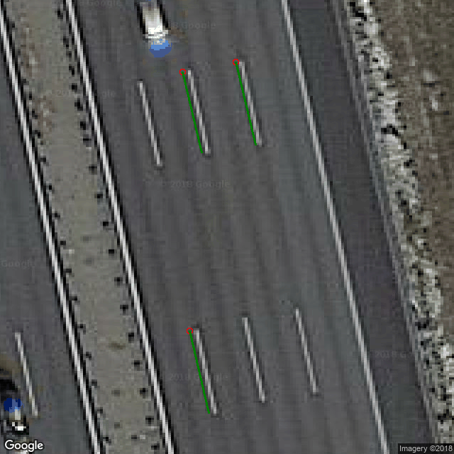

Google Maps Static Images with Markers
======================================

## Information

This library lets you download an image from the Google Maps API. It provides additional meta information as well as a few drawing functions.

You need a Google Maps API key. Put it in a file called ```googlemaps_apikey.txt```.

## Limitations

The Google Maps API provides images that are a few centimeters off. The reason is unknown.

## Installation

```bash
pip install https://github.com/stefan-urban/pygooglestaticmaps/archive/master.zip
```

## Examples

Show part of the german Autobahn A9. A Google Static Maps API key can be generated at https://developers.google.com/maps/documentation/static-maps/.

```python
from googlestaticmaps.provider import get_map_at_lonlat

themap = get_map_at_lonlat(lon=11.645244, lat=48.268232, zoom=21, imgSize=(700, 700), apikey="123456")

themap.mapImage.show()
```

Addionally you can create markers on the map, based on lat/lon data:

```python
from googlestaticmaps.markers import PointMarker, LineMarker

road_markings = [
    {'from': (11.645252, 48.268336), 'to': (11.645271, 48.268284)},
    {'from': (11.645202, 48.268330), 'to': (11.645220, 48.268279)},
    {'from': (11.645209, 48.268167), 'to': (11.645227, 48.268115)},
]

# Point markers
for road_marking in road_markings:
    themap.addMarker(PointMarker(
        road_marking['from'],
        radius=4,
        outline="red"),
        inhibitRender=True
    )

# Line markers
for road_marking in road_markings:
    themap.addMarker(LineMarker(
        [road_marking['from'], road_marking['to']],
        lineWidth=3,
        color="green"
    ), inhibitRender=True)

themap.render().show()


```

